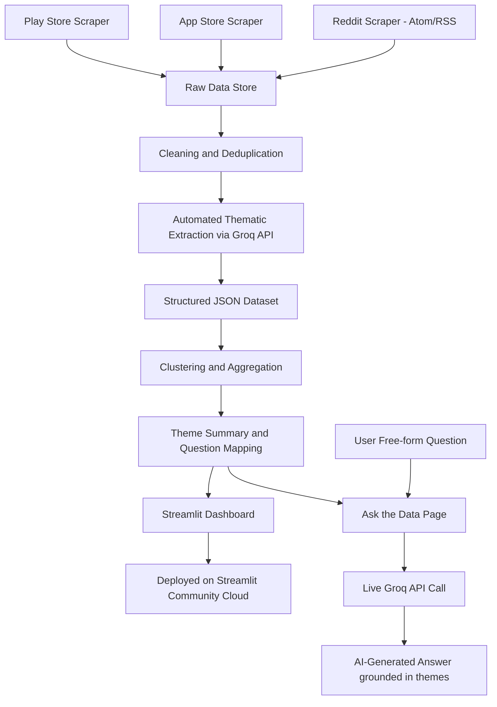

# System Architecture: AI-Powered Music App Review Analysis

## 1. Project Overview

This project builds an AI-powered system to analyze user feedback at scale for a music streaming app, in order to answer six core questions about music discovery and recommendation experiences:

1. Why do users struggle to discover new music?
2. What are the most common frustrations with recommendations?
3. What listening behaviors are users trying to achieve?
4. What causes users to repeatedly listen to the same content?
5. Which user segments experience different discovery challenges?
6. What unmet needs emerge consistently across reviews?

The system collects user feedback from Play Store, App Store, and Reddit, processes it through an AI-driven thematic extraction pipeline, aggregates findings into structured themes, and presents results through a deployed, shareable dashboard.

## 2. Constraints & Assumptions

- **AI engine**: Groq API (free tier) is used for the bulk thematic extraction step, since it offers free, fast, programmatic access to capable open models (e.g. Llama 3.x) with an OpenAI-compatible API, allowing the extraction pipeline to run as an automated batch script rather than requiring manual interactive sessions. Claude Code is used as the development tool throughout the project — to write the scrapers, design and validate the extraction prompt, build the clustering/aggregation scripts, and build the dashboard — but is not used to perform the bulk review analysis itself.
- **Budget**: Free-tier tools only, aside from the existing Claude Code subscription (used for development, not analysis).
- **Sources used**: Play Store reviews, App Store reviews, and Reddit discussions. Generic "community forums" and broader "social media" were excluded because no reliable free data access exists for them at this scope (e.g., X/Twitter's API is no longer free). Reddit is used as the representative social/community source, accessed via its public Atom/RSS listing feeds (no API key or OAuth required). Reddit's official Data API was ruled out because new apps now require explicit approval before access is granted, which is incompatible with a short deadline.
- **Dataset size**: Target ~500–1000 combined reviews/posts. This is large enough to surface credible patterns while remaining quick and cheap to process via the free Groq API tier.
- **Deployment**: The dashboard is deployed on Streamlit Community Cloud. The first four pages load exclusively from pre-computed JSON (no live API calls). A fifth page — "Ask the Data" — makes live calls to the Groq API using a key stored in Streamlit secrets, allowing users to ask free-form questions about the review data at runtime.

## 3. Architecture Diagram



## 4. Pipeline Stages

### Stage 1: Data Collection

**Purpose**: Gather raw user feedback from the three chosen sources.

**Input**: None (live scraping).
**Output**: Raw JSON/CSV files per source (`raw_playstore.csv`, `raw_appstore.csv`, `raw_reddit.csv`).

**Tools**: `google-play-scraper` for Play Store; iTunes RSS API (direct HTTP, no third-party library) for App Store; Reddit public Atom/RSS listing feeds (`/r/<subreddit>/top.rss`, `/hot.rss`, `/new.rss`) for Reddit — no API key or OAuth required.

**Instructions for Claude Code**:
- Write a Python script per source that pulls reviews/posts for a chosen music app (e.g. Spotify) and relevant subreddits (e.g. r/spotify, r/musicsuggest, r/spotifyplaylist).
- Each script should output a CSV with consistent columns: `source`, `id`, `text`, `rating` (if applicable), `date`, `extra_metadata`.
- Include basic error handling (rate limits, empty responses, pagination failures).
- Target ~300–400 records per source.
- **Reddit implementation note**: Reddit's official Data API now requires explicit app approval before access is granted, and the unauthenticated `.json` endpoints return HTTP 403 regardless of User-Agent. The Reddit scraper therefore uses the public Atom/RSS listing feeds, which remain accessible without credentials. Keyword search is not available via RSS (the `/search.rss` endpoint rate-limits aggressively), so volume is achieved by combining multiple subreddits and sort orders (top/year, top/month, hot, new). Only post titles and bodies are collected; top-level comments are not available via this approach. A 3-second delay is applied between requests to respect rate limits.

**Manual steps**: Choose the target app and subreddits; review a sample output to confirm data looks usable before scaling up.

**Validation & Test Cases**:

| Test | Method | Pass Criteria |
|---|---|---|
| Expected volume returned | Run scraper against known app/subreddit | Returns close to requested record count, not silently truncated |
| Pagination works | Request more records than one page would return | All pages retrieved, no duplicate page overlap |
| Special characters/emojis preserved | Inspect sample of output text fields | Emojis/non-ASCII text not corrupted or stripped |
| Graceful failure on rate limit | Simulate or trigger rate limit | Script retries/backs off rather than crashing |
| Schema consistency | Check output CSV columns | All three scrapers output the same column structure |

---

### Stage 2: Cleaning & Deduplication

**Purpose**: Remove noise so the analysis stage works on usable, non-redundant text.

**Input**: Raw CSVs from Stage 1.
**Output**: `cleaned_dataset.csv` (combined, deduplicated, source-tagged).

**Tools**: Python (pandas). No AI required.

**Instructions for Claude Code**:
- Merge the three raw files into one dataset with a unified schema.
- Remove exact and near-duplicate entries (e.g. via text hashing or similarity threshold).
- Filter out empty, extremely short (e.g. <5 words), or clearly spam entries.
- Optionally flag non-English entries (decide: drop or keep with a language tag) — note language detection is a known weak point of free tools, so keep this simple (e.g. `langdetect` library) and treat it as a flag, not a guarantee.

**Manual steps**: Decide the final policy on non-English content; spot-check a sample of removed rows to confirm nothing valid was dropped.

**Validation & Test Cases**:

| Test | Method | Pass Criteria |
|---|---|---|
| Duplicates removed | Insert known duplicate row, run cleaning | Duplicate no longer present in output |
| Empty/spam filtered | Insert blank and spammy test rows | Both excluded from cleaned output |
| Schema integrity | Check final CSV columns | Matches unified schema, no nulls in required fields |
| Non-English handling | Insert known non-English row | Flagged/dropped per chosen policy, consistently |

---

### Stage 3: Automated Thematic Extraction (Groq API)

**Purpose**: Convert unstructured review text into structured signals (pain point, user goal, segment, sentiment) using the Groq API as the analysis engine, enabling fully automated batch processing.

**Input**: `cleaned_dataset.csv`.
**Output**: `analyzed_dataset.json` — one structured record per review.

**Tools**: Groq API (free tier, OpenAI-compatible), Python script for batching, retries, and JSON parsing.

**Instructions for Claude Code (development task, not the analysis itself)**:
- Design an extraction prompt that returns the fixed JSON schema (defined in Section 5) for a given review: pain point category, user goal/intent, sentiment, and user segment signal.
- Write a Python script that loops through the full cleaned dataset, calls the Groq API per review (or small batches of reviews) using this prompt, and parses/validates the JSON response.
- Instruct the model explicitly, within the prompt itself, that `pain_point`, `user_goal`, and `segment_signal` must be `null` when there is no clear textual evidence for them, rather than forced/inferred just to fill the field. `sentiment` should remain mandatory, since it is reasonably inferable from nearly all text (including neutral/ambiguous cases).
- Include retry logic for rate limits/failures, and write results incrementally to `analyzed_dataset.json` so a failure partway through doesn't lose completed work.
- Choose a Groq-hosted model (e.g. a Llama 3.x variant) suited to structured extraction; confirm current model availability/limits at the time of building, since free-tier offerings change.

**Manual steps**: Before running the full dataset, hand-validate the extraction prompt against a small test set (10–15 reviews) — ideally first sanity-checked interactively in a Claude Code session to confirm the prompt design produces sensible output — then run the full automated batch via Groq once the prompt is trusted.

**Validation & Test Cases**:

| Test | Method | Pass Criteria |
|---|---|---|
| Schema compliance | Run extraction on 10–15 sample reviews | Output is valid JSON matching the defined schema for every record |
| Accuracy against manual judgment | Hand-label 10–15 reviews yourself first, compare to Groq's extraction | Majority agreement on pain point/sentiment/segment; document disagreements |
| Edge case handling (mixed sentiment, sarcasm, very short reviews) | Include a few tricky reviews in the test batch | Extraction degrades gracefully (e.g. "neutral/unclear" tag) rather than confidently wrong |
| No data loss across the full run | Compare total output record count to total input record count | Counts match after the full batch run completes |
| Appropriate use of null | Include reviews with only sentiment (no clear pain point/goal) in test batch | `pain_point`/`user_goal`/`segment_signal` correctly set to `null` rather than forced values |
| Rate limit / failure recovery | Simulate an API failure or rate limit mid-run | Script retries/resumes without losing already-completed records |

---

### Stage 4: Clustering & Aggregation

**Purpose**: Roll up individual structured extractions into recurring themes that answer the six assignment questions.

**Input**: `analyzed_dataset.json`.
**Output**: `theme_summary.json` (theme counts, representative quotes, segment breakdowns).

**Tools**: `sentence-transformers` (free, local embeddings) + clustering (KMeans or HDBSCAN), or simpler groupby/value_counts if extracted categories are already clean and consistent.

**Instructions for Claude Code**:
- If pain-point/goal categories from Stage 3 are reasonably consistent, aggregate directly via groupby and frequency counts.
- If categories are too free-form/varied, embed the free-text extraction fields and cluster them, then use Claude Code to label each cluster with a human-readable theme name.
- For each theme, retain: frequency count, example quotes (2–3 per theme), and segment breakdown (which user segments most associate with this theme).
- Since `pain_point`, `user_goal`, and `segment_signal` can be `null`, compute theme frequencies and percentages using field-specific denominators — e.g. "X% of reviews that expressed a pain point fall into category Y," using only the subset of reviews where that field is non-null, rather than dividing by the full dataset. This avoids diluting results with reviews that never expressed that signal in the first place.

**Manual steps**: Review cluster labels for coherence; merge/split clusters that are obviously redundant or too broad.

**Validation & Test Cases**:

| Test | Method | Pass Criteria |
|---|---|---|
| Cluster coherence | Spot-check 5 reviews from the same cluster | Reviews are thematically similar on manual read |
| Count sanity check | Manually skim a sample of raw reviews for an obvious theme (e.g. "repetitive recommendations") | Theme's reported frequency roughly matches manual impression |
| No orphaned/uncategorized majority | Check % of reviews left unclustered/unlabeled | Small minority only (e.g. <10%), not a large unexplained chunk |

---

### Stage 5: Dashboard & Deployment

**Purpose**: Present findings in a shareable, gradeable format.

**Input**: `theme_summary.json`, `analyzed_dataset.json`.
**Output**: Deployed Streamlit app with a public URL.

**Tools**: Streamlit, Streamlit Community Cloud (free), GitHub repo.

**Instructions for Claude Code**:
- Build a Streamlit app with four pages:
  1. **Overview** — dataset summary, source breakdown, sentiment distribution, sample reviews
  2. **Themes** — tabbed view of pain point themes, user goal themes, and user segments with drill-down detail and example quotes
  3. **Ask the Data** — free-form Q&A interface; user types any question, the app sends it to the Groq API along with the pre-loaded `theme_summary.json` as context, and returns an AI-generated answer grounded in the data; includes 5 clickable suggested questions and a graceful fallback if the question is out of scope
  4. **Methodology & Limitations** — pipeline documentation and caveats
- Pages 1, 2, and 4 load exclusively from pre-computed JSON files (no live API calls).
- Page 3 ("Ask the Data") makes live Groq API calls at runtime; the API key is stored in Streamlit secrets (never committed to the repo).
- Include a short methodology/limitations note in the app itself.

**Manual steps**: Push to GitHub, connect repo to Streamlit Community Cloud, add `GROQ_API_KEY` to Streamlit secrets via the app settings UI, verify the public link works in an incognito/logged-out browser before submitting.

**Validation & Test Cases**:

| Test | Method | Pass Criteria |
|---|---|---|
| Charts render correctly | Load each dashboard page | All charts/tables display without errors |
| Data consistency | Compare a number shown in dashboard to underlying JSON | Matches exactly |
| Public accessibility | Open deployed link in incognito/no login | Loads successfully, no auth wall |
| No broken dependencies | Fresh deploy from clean repo clone | App builds and runs without missing packages |
| Ask the Data — in-scope question | Ask a question directly about the themes (e.g. "What are the top pain points?") | Returns a specific, data-grounded answer with counts or percentages |
| Ask the Data — out-of-scope question | Ask something unrelated (e.g. "What is the weather?") | Model responds gracefully, stating it cannot answer from the review data |

## 5. Data Schema

Each review, after Stage 3 extraction, is represented as:

```json
{
  "id": "string",
  "source": "playstore | appstore | reddit",
  "text": "original review text",
  "rating": "number or null",
  "date": "ISO date",
  "pain_point": "short category label, or null if not present in the review",
  "user_goal": "short phrase, or null if not present in the review",
  "sentiment": "positive | negative | neutral | mixed",
  "segment_signal": "short phrase, or null if not inferable from the review",
  "confidence_note": "optional flag for ambiguous/edge cases"
}
```

`sentiment` is the only field that is always populated, since it can reasonably be inferred from almost any review (including a neutral/ambiguous reading). `pain_point`, `user_goal`, and `segment_signal` are independently nullable — a review may express any combination of these, including none at all (e.g. a purely positive review with no specific complaint, goal, or identifiable segment). Extraction should never force a value into these fields without clear textual evidence.

## 6. Deployment Plan

- **Repo structure**: `/scrapers`, `/processing`, `/analysis_outputs`, `/dashboard`, `system_architecture.md`, `README.md`.
- **Pre-computation**: All scraping, cleaning, extraction, and aggregation happen offline/in-session; only the final JSON outputs (`theme_summary.json`, `analyzed_dataset.json`) are committed to the repo and loaded by the dashboard.
- **Hosting**: Streamlit Community Cloud (free), connected directly to the GitHub repo for auto-deploy on push.
- **Secrets**: The `GROQ_API_KEY` is stored in Streamlit Cloud's secrets manager (not committed to the repo). The `.env` file used for local development is excluded via `.gitignore`.
- **Sharing**: Public Streamlit URL + GitHub repo link shared with the grader.

## 7. Limitations

- Analysis is based on a sample (~500–1000 records), not the full population of reviews/posts; findings are indicative, not exhaustive.
- Thematic extraction was performed via an automated Groq API pipeline using an open-weight model rather than a frontier model, and was only validated against a small hand-labeled sample rather than the full dataset, so some misclassification is expected.
- No formal inter-rater reliability study was conducted beyond spot-checking against manually labeled samples; extraction accuracy is approximated, not statistically validated.
- Pages 1, 2, and 4 of the dashboard use static, pre-computed results and do not reflect real-time data. The "Ask the Data" page (Page 3) makes live Groq API calls at runtime but answers are still grounded in the same pre-computed theme summary — it does not re-analyse raw reviews dynamically.

## 8. Mapping to Assignment Questions

| Question | Answered By |
|---|---|
| Why do users struggle to discover new music? | `pain_point` theme aggregation, filtered to discovery-related categories |
| What are the most common frustrations with recommendations? | `pain_point` theme frequency ranking |
| What listening behaviors are users trying to achieve? | `user_goal` aggregation |
| What causes users to repeatedly listen to the same content? | Cross-tab of `pain_point`/`user_goal` against "repetition" related themes |
| Which user segments experience different discovery challenges? | `segment_signal` cross-tabulated with discovery-related `pain_point` themes |
| What unmet needs emerge consistently across reviews? | Highest-frequency themes across the full `theme_summary.json`, regardless of category |
